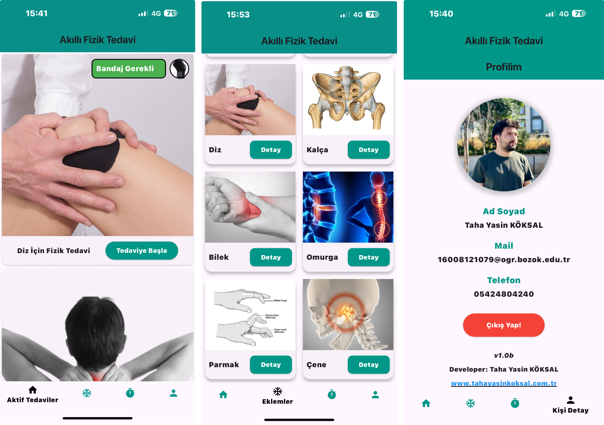
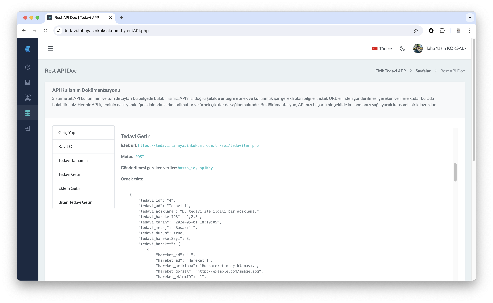
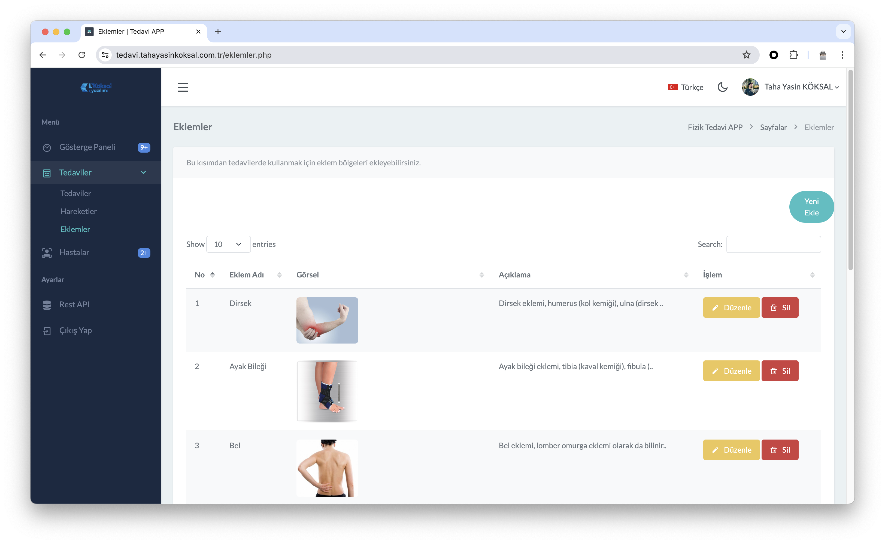
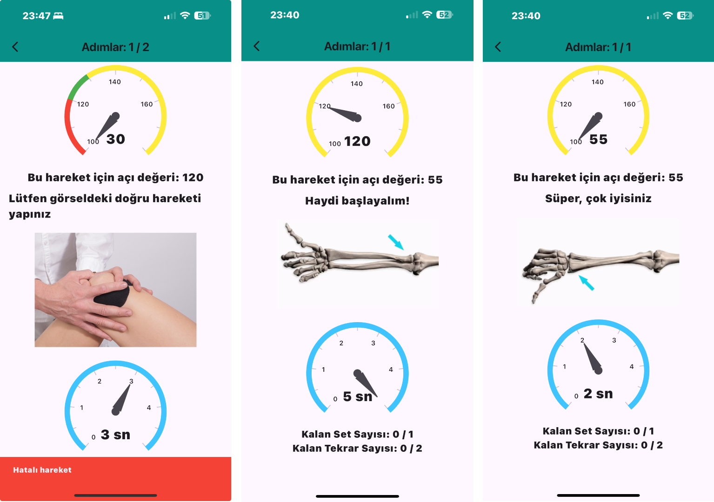
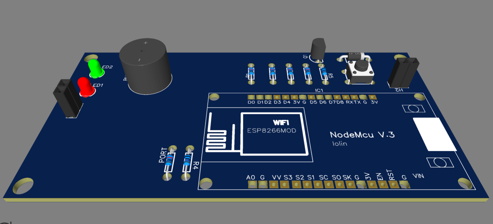

 <h1>Akıllı Fizik Tedavi Sistemi</h1>
    
Bu proje, yürüyüş bozukluğu olan bireylerin fizik tedavi sürecini yapay zeka destekli donanımlar kullanarak iyileştirmeyi amaçlamaktadır. Proje kapsamında akıllı bandaj sistemi, mobil uygulama ve web arayüzü geliştirilmiştir.

    <h2>Genel Bakış</h2>
    
Akıllı Fizik Tedavi Sistemi, doktorların hastaları için kişisel tedavi programları tanımlayabilmesine ve hastaların bu programları evde takip edebilmesine olanak tanır. Sistem, hastanın hareketlerini izleyen bir akıllı bandaj, talimatlar ve geri bildirim sağlayan bir mobil uygulama ve doktorların hasta ilerlemesini yönetip izleyebileceği bir web arayüzü içerir.

    <h2>Bileşenler</h2>
    <ul>
        <li><strong>Akıllı Bandaj:</strong> Hastanın hareketlerini izlemek için sensörler kullanır ve geri bildirim sağlar.</li>
        <li><strong>Mobil Uygulama:</strong> Hastaya egzersizler sırasında doğru hareket etmeleri için görsel ve metin tabanlı talimatlar sunar.</li>
        <li><strong>Web Arayüzü:</strong> Doktorların tedavi programlarını tanımlayıp hastaların ilerlemesini uzaktan izleyebilmesine olanak tanır.</li>
       
    </ul>
    <h2>Kullanılan Teknolojiler</h2>
    <ul>
        <li><strong>Programlama Dilleri:</strong> PHP, JavaScript, Java, Dart, Swift</li>
       
        <li><strong>Frameworkler:</strong>Flutter (mobil uygulama için)</li>
          
        <li><strong>Donanım:</strong> Entegre sensörler ve geri bildirim mekanizmaları ile özel tasarlanmış akıllı bandaj (ESP8266)</li>
      
        <li><strong>Yapay Zeka ve Makine Öğrenimi:</strong> Hareket verilerini analiz eden ve tedaviyi optimize eden algoritmalar</li>
    </ul>
    <h2>Kurulum</h2>
    
Projeyi yerel ortamınızda çalıştırmak için aşağıdaki adımları izleyin:

    <ol>
       <li>Depoyu klonlayın</li>
        <pre><code>git clone https://github.com/tahayasinkoksal/akilli-fizik-tedavi.git</code></pre>
        <li>Gerekli paketleri yükleyin</li>
        <pre><code>flutter pub get</code></pre>
        <li>Uygulamayı çalıştırın</li>
        <pre><code>flutter run</code></pre>
    </ol>
    <h2>Kullanım</h2>
    
Sistem kurulduktan sonra, doktorlar web arayüzüne giriş yaparak tedavi programlarını oluşturup hastalara atayabilirler. Hastalar, mobil uygulamayı kullanarak kendilerine atanan programları takip edebilir ve akıllı bandajdan gelen gerçek zamanlı geri bildirimleri alabilirler.

    <h2>Katkıda Bulunma</h2>
    
Projeye katkıda bulunmak isterseniz, lütfen önce depoyu fork'layın ve ardından geliştirmelerinizi pull request olarak gönderin.

    <h2>Lisans</h2>
    
Bu proje MIT Lisansı altında lisanslanmıştır.

    <h2>Teşekkürler</h2>
    
Bu proje, Bozok Üniversitesi'ndeki lisans tez çalışmam kapsamında, Dr. Mehmet Karabulut'un rehberliğinde geliştirilmiştir. Aileme ve arkadaşlarıma desteklerinden dolayı teşekkür ederim.

<h2>Proje Hakkında Detaylı Bilgi</h2>
    
Projem hakkında yazdığım detaylı bilgi alabileceğiniz lisans tezime <a href="https://github.com/tahayasinkoksal/akilli-fizik-tedavi/blob/main/git-assets/TahaYasinKOKSAL-BitirmeTezi-Lisans.pdf">burdan</a> ulaşabilirsiniz.

